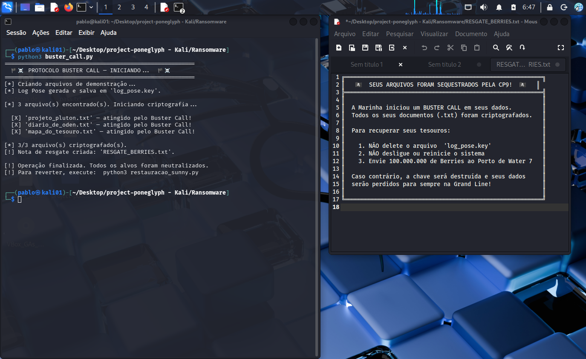
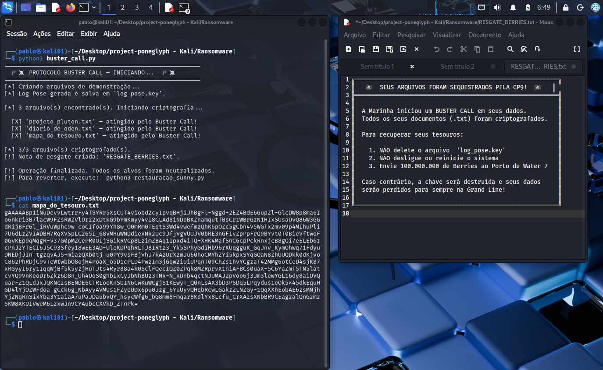
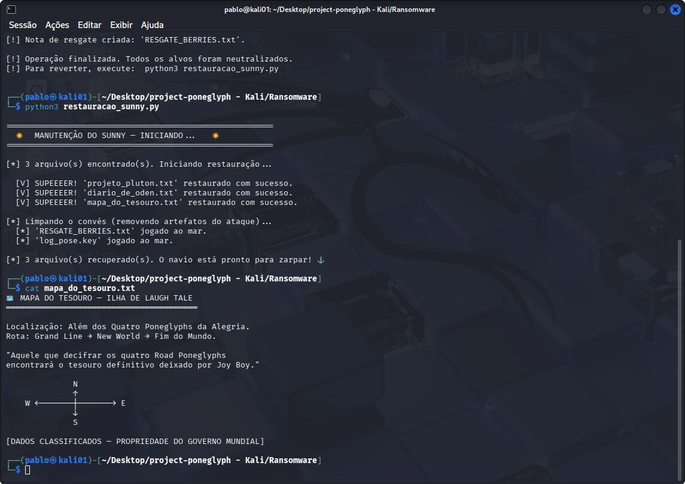
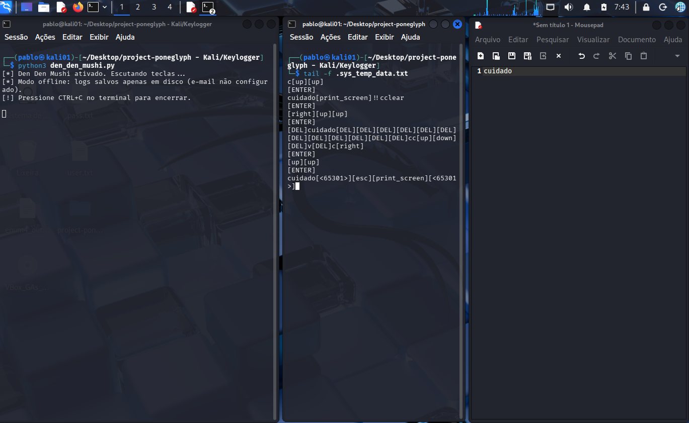
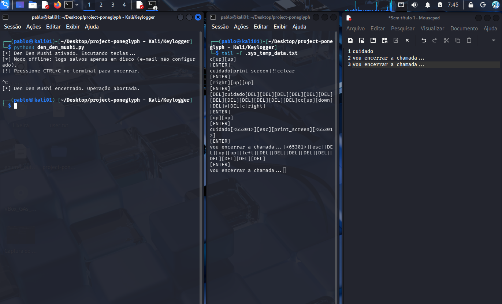

# 🏴‍☠️ Project Poneglyph — Operação Buster Call

<p align="center">
  
</p>

> *"O conhecimento é a arma mais poderosa da Grand Line."*

Projeto final do **Bootcamp de Cybersecurity da DIO** em parceria com a **Riachuelo**.  
Simulação educacional de malwares em Python, ambientada no universo de **One Piece**.

---

## 📜 Sumário

- [Sobre o Projeto](#-sobre-o-projeto)
- [Glossário da Grand Line](#-glossário-da-grand-line)
- [Estrutura do Repositório](#-estrutura-do-repositório)
- [As Quatro Ilhas do Laboratório](#️-as-quatro-ilhas-do-laboratório)
  - [Ilha de Ohara — Ransomware](#️-1-ilha-de-ohara--ransomware-buster-call)
  - [Water 7 — Descriptografia](#️-2-water-7--restauração-do-sunny)
  - [Enies Lobby — Keylogger](#-3-enies-lobby--keylogger-den-den-mushi)
  - [Marineford — Defesa](#️-4-marineford--estratégias-de-defesa)
- [Segurança de Credenciais](#️-segurança-de-credenciais)
- [Como Executar](#-como-executar)
- [Dependências](#-dependências)

---

## 🧭 Sobre o Projeto

Este repositório simula o comportamento de dois tipos clássicos de malware — **Ransomware** e **Keylogger** — em ambiente 100% controlado, com objetivo educacional.

A escolha temática de One Piece não é apenas estética: a obra é uma reflexão sobre **quem controla a informação controla o mundo**. O Governo Mundial apaga séculos de história (os "Poneglyphs"), a CP9 infiltra sistemas por dentro e os piratas resistem através da resiliência e do conhecimento — exatamente como profissionais de segurança.

---

## ⚓ Glossário da Grand Line

| Termo One Piece | Equivalente em Cybersecurity |
|---|---|
| **Buster Call** | Ataque de Ransomware (destruição em massa) |
| **Poneglyph** | Dado protegido / criptografado |
| **Log Pose** | Chave de criptografia simétrica |
| **Den Den Mushi** | Keylogger / Spyware |
| **CP9** | Agente de ameaça / Atacante |
| **Berries** | Resgate (ransom) exigido |
| **Sunny** | Sistema / Servidor da vítima |
| **Marineford** | Centro de defesa / SOC |

---

## 📁 Estrutura do Repositório

```
project-poneglyph/
│
├── assets/                       # Imagens e capturas de tela
│   ├── capa.png
│   ├── frist_bust.png
│   ├── beerris.png
│   ├── rest_sunny.png
│   ├── den_den_ativo.png
│   └── den_den_desligado.png
│
├── Ransomware/
│   ├── buster_call.py            # Ransomware simulado
│   ├── restauracao_sunny.py      # Descriptografia / recuperação
│   ├── mapa_do_tesouro.txt       # Arquivo de exemplo (alvo)
│   ├── diario_de_oden.txt        # Arquivo de exemplo (alvo)
│   └── projeto_pluton.txt        # Arquivo de exemplo (alvo)
│
├── Keylogger/
│   └── den_den_mushi.py          # Keylogger simulado
│
├── README.md                     # Este arquivo
└── .gitignore                    # Exclui artefatos gerados e credenciais
```

---

## 🗺️ As Quatro Ilhas do Laboratório

### ☠️ 1. Ilha de Ohara — Ransomware (Buster Call)

<p align="center">
  
</p>

**Script:** `Ransomware/buster_call.py`

Simula um ataque de ransomware que criptografa arquivos `.txt` no diretório `Ransomware/`.

**Como funciona:**
1. Gera uma chave simétrica **Fernet** (salva em `log_pose.key`)
2. Lista todos os arquivos `.txt` elegíveis no diretório
3. Criptografa cada um com a chave gerada
4. Exibe (e abre) a nota de resgate `RESGATE_BERRIES.txt`

**Por que Fernet?**  
O algoritmo Fernet garante confidencialidade e integridade usando AES-128-CBC com HMAC-SHA256. Sem a chave exata, a descriptografia é computacionalmente inviável.

<p align="center">
  
</p>

```
[*] Log Pose gerada e salva em 'log_pose.key'.
[*] 3 arquivo(s) encontrado(s). Iniciando criptografia...

  [X] 'mapa_do_tesouro.txt'  — atingido pelo Buster Call!
  [X] 'diario_de_oden.txt'   — atingido pelo Buster Call!
  [X] 'projeto_pluton.txt'   — atingido pelo Buster Call!

[*] 3/3 arquivo(s) criptografado(s).
[!] Nota de resgate criada: 'RESGATE_BERRIES.txt'.
```

---

### ☀️ 2. Water 7 — Restauração do Sunny

<p align="center">
  
</p>

**Script:** `Ransomware/restauracao_sunny.py`

Representa a recuperação pós-incidente: reverte a criptografia usando a `log_pose.key`.

**Como funciona:**
1. Carrega a chave de `log_pose.key`
2. Descriptografa cada arquivo `.txt` afetado
3. Remove os artefatos do ataque (`RESGATE_BERRIES.txt` e `log_pose.key`)

> **Lição:** sem backup da chave, os dados são irrecuperáveis. A única defesa real é o backup offline preventivo.

```
[V] SUPEEEER! 'mapa_do_tesouro.txt' restaurado com sucesso.
[V] SUPEEEER! 'diario_de_oden.txt'  restaurado com sucesso.
[V] SUPEEEER! 'projeto_pluton.txt'  restaurado com sucesso.

[*] 'RESGATE_BERRIES.txt' jogado ao mar.
[*] 'log_pose.key' jogado ao mar.
```

---

### 🐚 3. Enies Lobby — Keylogger (Den Den Mushi)

<p align="center">
  
  
</p>

**Script:** `Keylogger/den_den_mushi.py`

Simula um keylogger furtivo que captura teclas e (opcionalmente) as exfiltra por e-mail.

**Características implementadas:**

| Feature | Descrição |
|---|---|
| **Hooking de teclado** | `pynput.keyboard.Listener` em thread separada |
| **Buffer em memória** | Teclas acumuladas antes de serem escritas em disco |
| **Arquivo oculto** | Log salvo em `.sys_temp_data.txt` (oculto em Unix) |
| **Exfiltração por e-mail** | Envio periódico via SMTP/SSL ao atacante |
| **Segurança de credenciais** | E-mail e senha via variáveis de ambiente |
| **Furtividade** | Falha silenciosa em todas as exceções |
| **Auto-instalação** | Instala `pynput` automaticamente se ausente |

**Teclas especiais mapeadas:**

```
[ENTER]  [DEL]  [Tab]  [esc]  [f1]...[f12]  etc.
```

---

### 🛡️ 4. Marineford — Estratégias de Defesa

Entender o ataque é o primeiro passo para a proteção.

#### Contra Ransomware

| Medida | Descrição |
|---|---|
| **Backup 3-2-1** | 3 cópias, 2 mídias diferentes, 1 offsite/offline |
| **EDR / Antivírus** | Detecta modificação em massa e rápida de arquivos |
| **Princípio do menor privilégio** | Limita o alcance do ransomware ao que o usuário pode acessar |
| **Segmentação de rede** | Impede propagação lateral |

#### Contra Keylogger

| Medida | Descrição |
|---|---|
| **Firewall de saída** | Bloqueia porta 465/SMTP de processos não autorizados |
| **EDR comportamental** | Detecta processos escutando eventos de teclado globalmente |
| **Autenticação 2FA** | Mesmo com senha capturada, o acesso é bloqueado |
| **Teclado virtual** | Contorna keyloggers baseados em hooking de hardware |

#### Defesa Humana (a mais importante)

> *"O Haki da Observação começa em você."*

- Não executar arquivos de fontes desconhecidas
- Desconfiar de e-mails com anexos ou links urgentes (phishing)
- Manter sistemas e dependências atualizados
- Conscientização contínua da equipe

---

## 🛡️ Segurança de Credenciais

O `den_den_mushi.py` **nunca** armazena e-mail ou senha no código.  
As credenciais são lidas via **variáveis de ambiente**:

```bash
export EMAIL_USER="seu-email@gmail.com"
export EMAIL_PASS="sua-senha-de-aplicativo"
```

> **Dica:** No Gmail, gere uma **Senha de Aplicativo** em  
> `Conta Google → Segurança → Verificação em duas etapas → Senhas de app`.  
> Nunca use sua senha principal.

Sem as variáveis, o script funciona normalmente em modo offline (salva apenas em disco).

---

## 🛠️ Como Executar

> [!CAUTION]
> **AVISO DE SEGURANÇA:** Execute exclusivamente em **ambientes isolados** (VMs / sandbox).  
> Nunca rode em sua máquina principal ou em redes corporativas.

### 1. Clone o repositório

```bash
git clone https://github.com/seu-usuario/project-poneglyph.git
cd project-poneglyph
```

### 2. Instale as dependências

```bash
pip install cryptography pynput
```

### 3. Simule o Ransomware

```bash
cd Ransomware
python3 buster_call.py
```

### 4. Restaure os arquivos

```bash
python3 restauracao_sunny.py
```

### 5. Inicie o Keylogger (opcional)

```bash
cd ../Keylogger

# Configure as variáveis de ambiente (se quiser testar o envio por e-mail)
export EMAIL_USER="seu-email@gmail.com"
export EMAIL_PASS="sua-senha-de-aplicativo"

python3 den_den_mushi.py
# Pressione CTRL+C para encerrar
```

---

## 📦 Dependências

| Biblioteca | Uso |
|---|---|
| [`cryptography`](https://cryptography.io/en/latest/) | Criptografia Fernet (Ransomware) |
| [`pynput`](https://pynput.readthedocs.io/) | Captura de teclado (Keylogger) |
| `smtplib` *(stdlib)* | Envio de e-mail via SMTP |
| `threading` *(stdlib)* | Ciclo de exfiltração em background |

---

<div align="center">

Desenvolvido por **Pablo Monteiro**  

*"D. no nome significa que você vai lutar até o fim."* 🏴‍☠️

</div>
